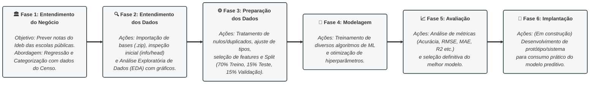

# Projeto: Análise de Dados e Machine Learning (Python / Orange)

## Alunos
[](https://github.com/Rflavia) 
[](https://github.com/clara-cecilia) 
[](https://github.com/itagibanetos) 
[](https://github.com/presley-rocha) 
[](https://github.com/theminas)

# 📊 Previsão e Análise do IDEB com base em dados do Censo Escolar

> **Bibliotecas:** Pandas, Matplotlib, Seaborn, Scikit-Learn
> **Ferramentas:** VS Code, Python, Orange Data Mining

---

## 📌 Metodologia: CRISP-DM

Este projeto foi desenvolvido seguindo as diretrizes da metodologia **CRISP-DM** (*Cross-Industry Standard Process for Data Mining*), dividida nas seguintes fases:

---



### 🏛️ Fase 1: Entendimento do Negócio (*Business Understanding*)
**Contextualização e Objetivos:**
* Este trabalho tem como objetivo prôpor um modelo para previsão das notas de avaliação do Ideb das escolas públicas do ensino médio tendo como variáveis de entrada um conjunto de dados de infraestrutura física e educacional dessas escolas, esses dados são levantados na pesquisa do Censo Escolar realizado pela INEP.
* Para o trabalha usamos duas metodologias, 1° seguindo com uso de algoritmos de regressão e posteriormente dividindo as notas em intervalos e usando algoritmos de categorização.

**Links úteis para leitura e entendimento do negócio:**
* 🔗 [Censo Escolar](https://www.gov.br/inep/pt-br/areas-de-atuacao/pesquisas-estatisticas-e-indicadores/censo-escolar)
* 🔗 [Avaliação do Ideb](https://www.gov.br/inep/pt-br/areas-de-atuacao/pesquisas-estatisticas-e-indicadores/ideb)

---

### 🔍 Fase 2: Entendimento dos Dados (*Data Understanding*)

**Sobre os Datasets:**
Nesse projeto trabalhamos com dois datasets compactados:
* `IBED_Escolas_Ensino_medio_2025.zip`: Dados das escolas de ensino médio e suas respectivas notas no Ideb.
* `Tabela_Escola_2025_INEP.zip`: Dados das escolas a partir do Censo Escolar realizado pelo INEP.

**Dicionário de Dados (Detalhamento das Colunas):**
* Para entendimento das variáveis do Dataset sobre o Censo Escolar, utilize o Dicionário de dados em anexo ao projeto.
* 📄 [01.Endendimento_dos_dados.md](https://github.com/presley-rocha/Aprendizagem_de_maquina_supervisionado_POS_DATASCIENCE_SENAC/blob/main/2_NoteBooks_Etapas_Projeto/01.Entendimento_dos_dados.md)

**Importação e Inspeção Inicial:**
* Realização da leitura dos arquivos `.csv` compactados em `.zip` (ex: utilizando `pd.read_csv()` e `zipfile.ZipFile`).
* Verificação das primeiras e últimas linhas (`head()` / `tail()`).
* Análise preliminar de dimensões (linhas e colunas) e tipos de dados estruturais (`info()`).

**Análise Gráfica dos Dados (EDA):**
* **Visualização Univariada:** Gráficos de distribuição, histogramas e boxplots para entender a dispersão das variáveis numéricas e contagens para as categóricas.
* **Visualização Bivariada / Multivariada:** Matriz de correlação (heatmap) para identificar relações lineares entre variáveis; gráficos de dispersão (`scatter plots`) cruzando variáveis preditoras com a variável alvo.
* *Ferramentas aplicadas:* Matplotlib, Seaborn e componentes gráficos nativos do Orange (Box Plot, Scatter Plot, Distributions).

---

### ⚙️ Fase 3: Preparação dos Dados (*Data Preparation*)

**Tratamento de Colunas e Linhas:**
* **Limpeza de Dados:** Identificação e tratamento de valores ausentes (`NaN`, nulos ou lacunas), tratamento de linhas duplicadas e registros inconsistentes/inválidos.
* **Ajustes de Tipos:** Conversão de tipos de dados (ex: strings para numéricos, datas, categorias).
* **Seleção de Atributos:** Remoção de colunas irrelevantes, redundantes ou com alta taxa de ruído.

**Separação dos Arquivos (Treino, Teste e Validação):**
* **Estratificação da Amostra:** Divisão do dataset seguindo a proporção solicitada:
  * **Treino:** 70% dos dados (aprendizado dos padrões pelos algoritmos).
  * **Teste:** 15% dos dados (avaliação de desempenho intermediária e ajuste de hiperparâmetros).
  * **Validação:** 15% dos dados (avaliação final de generalização com dados totalmente blindados).
* *Método:* Utilização de funções de divisão aleatória ou estratificada (ex: `train_test_split` do Scikit-Learn ou módulos no Orange).

---

### 🤖 Fase 4: Modelagem (*Modeling*)

**Treinamento de Diferentes Algoritmos de ML:**
* **Modelagem Preditiva:** Seleção e treinamento de múltiplos algoritmos compatíveis com o problema (ex: Regressão Logística, Árvores de Decisão, Random Forest, SVM, KNN, entre outros).
* **Ajuste de Hiperparâmetros:** Otimização inicial dos parâmetros de cada modelo para extrair o melhor desempenho possível dos dados de treino.

---

### 📈 Fase 5: Avaliação (*Evaluation*)

**Análise de Métricas dos Algoritmos:**
* **Avaliação de Desempenho:** Comparação dos resultados obtidos nos conjuntos de teste e validação utilizando métricas adequadas ao tipo de problema
* **Seleção do Melhor Modelo:** Justificativa da escolha do algoritmo vencedor com base na performance geral e estabilidade frente aos dados de validação.

---

### 🚀 Fase 6: Implantação (*Deployment*)

**Implantar em Produção:**
* Desenvolvimento do protótipo `implementacao.py`, que consome os modelos treinados e permite consultar a previsão do IDEB a partir do código INEP de uma escola.
* O script carrega dois modelos:
  * **Regressão:** `Regressão/modelo_ideb.pkl` (scikit-learn / joblib), que prevê o valor contínuo do IDEB.
  * **Classificação:** `Classificação/orange/GB_model.pkcls` (Orange), que prevê a faixa do IDEB (II, MI, MM ou MS).
* Para cada escola consultada, o sistema exibe ao mesmo tempo o IDEB previsto, a faixa prevista, as probabilidades de cada faixa e uma comparação com o valor real presente na base.

**Como executar:**

O modelo de classificação é um arquivo `.pkcls` salvo pelo Orange, portanto é necessário ter o Orange instalado. A forma mais simples é usar o Python que já vem embutido no Orange.

1. Instale o Orange (caso ainda não tenha):
   ```powershell
   winget install UniversityofLjubljana.Orange

2. Na pasta do projeto, execute o script com o Python do Orange:

  ```powershell
  & "$env:LOCALAPPDATA\Programs\Orange\python.exe" implementacao.py

3. Digite o código INEP (8 dígitos) de uma escola pública de ensino médio presente na base. Digite sair para encerrar.
